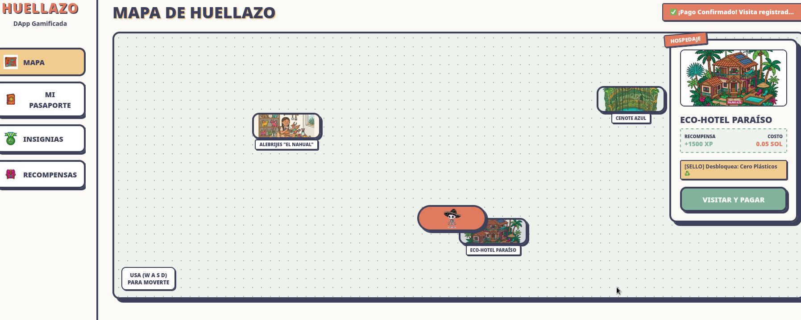
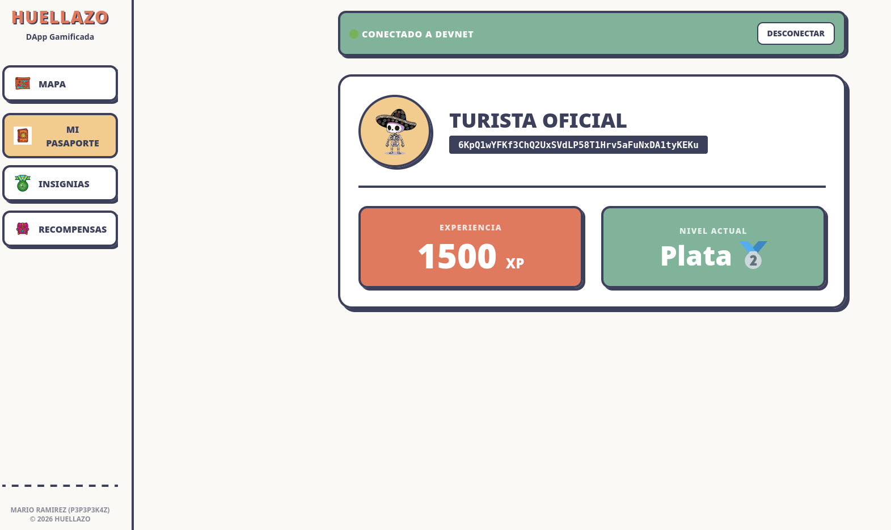
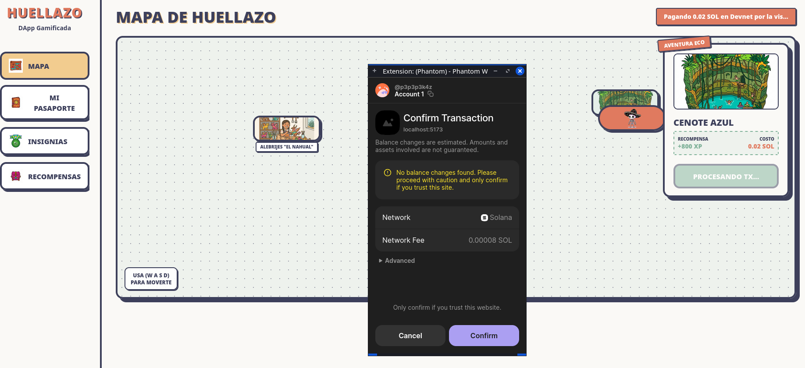

# Huellazo 

**Turismo inteligente, economía circular y gamificación impulsados por Solana.**

Huellazo transforma la experiencia del turista mediante una plataforma descentralizada diseñada para eliminar la fricción entre la blockchain y los usuarios nuevos. A través de un mapa interactivo tipo RPG, la aplicación conecta a los turistas con una red de comercios locales, incentivando el consumo, la exploración de lugares no tradicionales y el turismo sostenible.

---

## Ecosistema NFT y Fidelización

El corazón de Huellazo se basa en redefinir la lealtad del cliente mediante tecnología blockchain:

*   **Pasaporte como NFT Dinámico (Membresía):** Al interactuar por primera vez, el turista "mintea" un Pasaporte on-chain que actúa como una llave de acceso física y digital. Este NFT es evolutivo: a medida que el usuario viaja y acumula experiencia, su nivel cambia dinámicamente (Bronce, Plata, Oro), desbloqueando beneficios, descuentos y menús exclusivos en la red de comercios.
*   **Programa de Fidelidad (Economía Circular):** Cada visita a un comercio local (un "Huellazo") otorga **Puntos Eco**. Este sistema de misiones (Quest-Local) fideliza al turista recompensándolo por descubrir joyas locales. Estos puntos sientan las bases de una economía circular y son el preludio del token de fidelidad $HUELLA, que tendrá valor real para pagar transporte, artesanías o servicios.
*   **NFTs de Eco-Viajero:** Las acciones responsables (como elegir opciones sin plástico) se certifican en la blockchain otorgando insignias inmutables, premiando la fidelidad hacia el medio ambiente con acceso a eventos premium.

---

## ✨ Módulos Integrados y Características

* **Motor de Mapa Interactivo 2D:** Explora el ecosistema moviendo a tu avatar (una calaverita tradicional) por el mapa usando las flechas del teclado.
* **Integración Web3 Híbrida:** 
  * Los usuarios firman transacciones reales en Devnet usando su wallet Phantom.
  * Emisión de pasaportes inmutables en la blockchain.
  * Transferencias de SOL en tiempo real al visitar negocios locales.
* **Gamificación y Tokenomics:** 
  * Gana XP por cada interacción y sube de rango (Bronce 🥉, Plata 🥈, Oro 🏆).
  * Acumula "Puntos Eco" canjeables en el ecosistema local.
* **Certificación de Eco-Sellos:** Los negocios de Tier 2 (ej. Eco-Hoteles) otorgan insignias verificables on-chain (ej. "Cero Plásticos") al visitarlos.

<p align="center">
  
  
  
</p>

---

## Arquitectura y Tecnologías

El proyecto está dividido en dos grandes bloques: el **Backend** (Smart Contracts) y el **Frontend** (React + Web3).

### Backend (Smart Contract)
Construido con el framework **Anchor** en Rust y desarrollado íntegramente en el entorno de **Solana Playground**.
*   Utiliza **PDAs (Program Derived Addresses)** para el manejo seguro e inmutable de los pasaportes (NFT dinámico) y el registro de los comercios.
*   Desplegado en la red **Solana Devnet** por su alta velocidad y bajos costos de transacción.

#### Arquitectura del Estado (Cuentas PDA)
El protocolo gestiona el estado a través de tres cuentas derivadas de programa (PDAs) principales, garantizando que los datos sean inmutables y deterministas:
*   `GlobalConfig` *(Seed: "config")*: Cuenta singleton que almacena la autoridad del administrador y las métricas globales del protocolo (ej. total de turistas).
*   `Passport` *(Seeds: "passport" + User Pubkey)*: El NFT Dinámico del turista. Almacena su progreso: Nivel (u8), Experiencia (u64), Puntos de Fidelidad (u64) y Sellos Ecológicos.
*   `Merchant` *(Seeds: "merchant" + Authority Pubkey)*: Estructura de comercios que almacena su nivel de certificación (`Tier`), nombre y estado operativo.

#### Lógica de Negocio y Optimizaciones (`lib.rs`)
*   **Gamificación On-Chain (`record_visit`):** La validación de niveles (Bronce, Plata, Oro) ocurre directamente en la blockchain. Al alcanzar ciertos umbrales de XP (1000, 5000), el contrato actualiza automáticamente el estado del turista sin depender de lógica off-chain.
*   **Eficiencia de Almacenamiento Bitwise (`validate_eco_action`):** Para mantener los costos de renta de la cuenta al mínimo, los sellos ecológicos ("Eco-Flags") no usan arreglos costosos. Se almacenan en un solo byte (`u8`) utilizando operadores bit a bit (`eco_flags |= 1 << action_id`).
*   **Seguridad Estricta (Anchor Constraints):** Se implementaron validaciones rigurosas a nivel de contexto como `has_one = authority` para evitar ataques de suplantación, y `constraint = merchant.tier == 2` para garantizar que solo los Eco-Hoteles autorizados puedan emitir certificaciones sustentables.
*   **Recuperación de Renta (`close_passport`):** Implementación de la instrucción de cierre de cuentas que permite al turista destruir su pasaporte y recuperar los Lamports (SOL) utilizados para pagar la renta del espacio en la red.

#### Entorno de Pruebas y Scripts E2E
El repositorio incluye un ecosistema robusto de herramientas en TypeScript para interactuar con la Devnet:
*   `tests/anchor.test.ts`: Suite de pruebas BDD (Behavior-Driven Development) usando Mocha y Chai. Valida el ciclo de vida completo del usuario: Setup -> Emisión -> Visita -> Eco-Sello -> Cierre de Cuenta.
*   `client/client.ts`: Un SDK simulado que encapsula la lógica de derivación de PDAs, autofondeo de wallets de prueba y confirmación explícita de transacciones RPC para evitar condiciones de carrera en la lectura del estado.
*   `client/seed.ts`: Script de inicialización para automatizar el poblamiento de la red con datos de prueba reales (ej. creación de comercios, hoteles y talleres), facilitando las pruebas de extremo a extremo (E2E) con el frontend.

### Frontend (dApp)
Construido con **React, Vite, Tailwind CSS y Solana Web3**.
*   **Motor de Juego:** Custom hooks (`useGameEngine.ts`) para manejar el renderizado interactivo en `GameCanvas.tsx`, permitiendo al usuario moverse por el mapa.
*   **Conexión Blockchain:** `@solana/web3.js` y `@solana/react-hooks` gestionados a través de `useHuellazoWeb3.ts`.
*   **Codama SDK:** Ubicado en `src/generated/vault/`, generado automáticamente para interactuar de forma tipada con el Smart Contract.
*   Diseñado con miras a una futura integración con **Solana Blinks/Actions** para facilitar pagos directamente desde redes sociales.

---

## Estructura de Directorios (Frontend)

```text
src/
├── components/
│   ├── Dashboard/        # Navegación principal y Sidebar lateral
│   ├── Map/
│   │   ├── GameCanvas.tsx # Renderizado del mapa 2D y el sprite del jugador
│   │   └── PoiCard.tsx    # Modal interactivo para pagos y registro de visitas
├── hooks/
│   ├── useGameEngine.ts   # Lógica matemática de movimiento y colisiones
│   ├── useHuellazoWeb3.ts # Orquestador de transacciones hacia Solana Devnet
├── views/                 # Pantallas principales de la aplicación
│   ├── MapView.tsx        # Contenedor del juego y mapa
│   ├── ProfileView.tsx    # Estadísticas del pasaporte on-chain
│   ├── BadgesView.tsx     # Galería de Eco-Sellos y NFTs desbloqueados
│   └── RewardsView.tsx    # Tienda de canje de puntos de fidelidad
├── generated/vault/       # SDK autogenerado por Codama
└── public/assets/         # Sprites e imágenes de la temática mexicana
```

---

### ejecutar el proyecto en local
Requisitos Previos

`    Node.js (v18+)

    Extensión de billetera Phantom instalada en el navegador (configurada en Devnet).

    SOL de prueba (Devnet SOL).`

Instalación

`    Clona el repositorio e ingresa al directorio del frontend:
    Bash

    cd huellazo

    Instala las dependencias:
    Bash

    npm install

    Inicia el servidor de desarrollo:
    Bash

    npm run dev`

    Abre http://localhost:5173 en tu navegador.

--- 
## Retos Superados y Soluciones

### Integración del Smart Contract con el Frontend
Uno de los mayores retos del proyecto fue conectar exitosamente la lógica de nuestro contrato en Rust (creado en Solana Playground) con nuestra interfaz en React de manera tipada y segura. 

Para solucionarlo y agilizar el desarrollo, utilizamos **Codama** (un generador de clientes para Solana), siguiendo este flujo de trabajo:

1. **Exportación desde Solana Playground:** Descargamos nuestro código funcional y extrajimos el archivo `idl.json` generado por Anchor.
2. **Configuración del IDL:** Tomamos una plantilla base de frontend (https://github.com/WayLearnLatam/Solana-Hackathon-Template-FullStack.git) y reemplazamos su archivo de IDL genérico (`idl/vault.json`) por el de Huellazo.
3. **Inyección del Program ID:** Para que el generador funcionara correctamente con Devnet, tuvimos que inyectar manualmente el campo `"address": "CB2sVYQ48i3rTdM51zKxipweoFpxEEmJVC1NgxLeT5Xj"` (nuestro ID de programa) dentro de la raíz del archivo JSON. Esto va en el vault.json
4. **Generación del SDK:** Ejecutamos el comando `npm run codama:js`. Esto leyó nuestro IDL y autogeneró toda la lógica del backend, cuentas e instrucciones tipadas en TypeScript dentro de la carpeta `src/generated/vault/`.
5. **Refactorización:** Finalmente, eliminamos la lógica por defecto de la plantilla (como el componente `VaultManager`) y la reemplazamos construyendo nuestros propios Custom Hooks (`useHuellazoWeb3.ts`), consumiendo directamente las funciones exactas de nuestro ecosistema.

Durante el desarrollo de Huellazo, nos enfrentamos a las estrictas reglas de seguridad y serialización de Solana, resolviendo problemas críticos de integración:

### 1. Generación Incompleta del SDK (Validación Base58)
Al utilizar Codama para autogenerar nuestro cliente, descubrimos un caso borde: la variable `HUELLAZO_PROGRAM_ADDRESS` se generaba vacía, lo que provocaba que el frontend colapsara con el error `Expected base58-encoded address string of length in the range [32, 44]. Actual length: 0`. 
**Solución:** Inyectamos y forzamos manualmente el Program ID estático (`CB2sVY...` tipado como `Address`) directamente en nuestros Custom Hooks de React para garantizar la resolución de las PDAs.

### 2. Estrictez de Permisos en Rust vs. UX (Errores #2001 y #3012)
Nuestro Smart Contract en Anchor tiene una seguridad impecable: usa la restricción `ConstraintHasOne` para que *solo* el administrador original (desde Solana Playground) pueda registrar comercios. Al probar con billeteras de turistas (Phantom), Solana bloqueaba las transacciones de validación lanzando errores de "Autoridad Inválida" (#2001) y "Cuenta no Inicializada" (#3012).
**Solución (Modo Híbrido):** Para no comprometer la seguridad del contrato en Rust pero permitir una demo fluida en el frontend, diseñamos una arquitectura híbrida. Las creaciones de pasaportes usan las PDAs estrictas, pero las interacciones de "Visita" utilizan instrucciones nativas de transferencia de SOL, validando la experiencia en el estado local de React.

### 3. Serialización a Nivel de Bytes (Little-Endian)
Al intentar construir instrucciones de transferencia nativas desde cero (`System Program`), la blockchain rechazaba nuestras transacciones indicando un formato inválido (`transactionPlanResult`). Solana exige un empaquetado de memoria extremadamente preciso.
**Solución:** Implementamos `DataView` nativo de JavaScript para construir el buffer de memoria exacto de 12 bytes requerido por Solana: 4 bytes para indicar la instrucción *Transfer* (`setUint32`) y 8 bytes para el monto en lamports (`setBigUint64`), todo forzado en formato *Little-Endian*.

### 4. Cuentas de Solo Lectura (Writable Error)
Durante las pruebas de pago simulado, intentamos enviar los fondos quemados a la dirección base del `System Program` (1111...1111), lo que provocó que la red abortara la transacción porque las cuentas nativas de la red no pueden marcarse como `writable` (modificables).
**Solución:** Se configuró una wallet "Caja Registradora" estática en Devnet (`RECEPTOR_PAGO_SIMULADO`) para recibir los fondos de forma segura y cumplir con las reglas de mutabilidad de cuentas de Solana.

### 5. Sincronización y Latencia RPC ("Account does not exist")
Al desarrollar nuestros scripts de prueba en `client.ts` y simular el ciclo completo del protocolo, nos topamos con un problema de condición de carrera: creábamos una cuenta (como el Pasaporte) y al intentar leerla inmediatamente en la siguiente línea, la red arrojaba el error `Account does not exist` o nos devolvía datos en `0`.
**Solución:** Entendimos cómo funciona el consenso de Solana. Modificamos el `AnchorProvider` para inyectarle la configuración de `commitment = "confirmed"`. Además, implementamos esperas explícitas en el cliente (`await program.provider.connection.confirmTransaction`) para obligar al script a esperar a que el bloque se confirmara en Devnet antes de ejecutar el `fetch` de los datos.

### 6. Derivación Precisa de PDAs (Program Derived Addresses)
En el backend, el Smart Contract asocia los datos de cada usuario usando cuentas derivadas (PDAs). Sin embargo, al principio el cliente en TypeScript (`client.ts`) no lograba encontrar estas cuentas, generando fallos de firmas y de validación cruzada.
**Solución:** Se estandarizó la derivación de semillas entre Rust y TypeScript. Implementamos funciones *helper* (`getPda`) utilizando `web3.PublicKey.findProgramAddressSync`, asegurándonos de empaquetar correctamente los *buffers* (`Buffer.from("passport")` junto con `userWallet.toBuffer()`) para que coincidieran byte por byte con las macros `#[account(seeds = [...])]` definidas en nuestro código de Anchor.