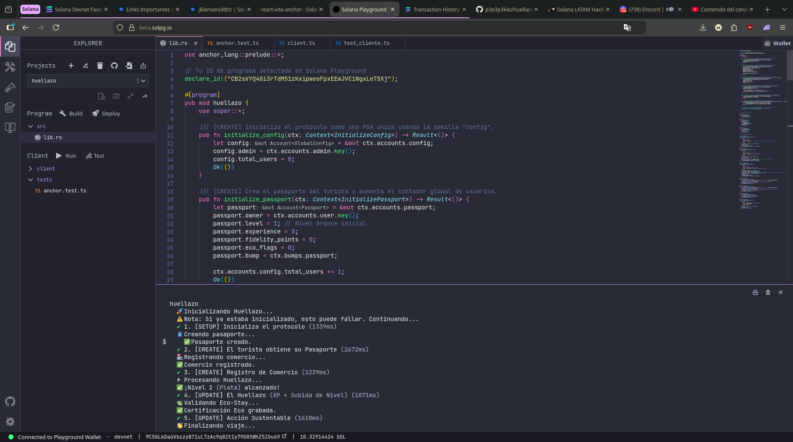

# Huellazo 💀

> **Turismo inteligente, economía circular y gamificación impulsados por Solana.**

Huellazo transforma la experiencia del turista mediante una plataforma descentralizada con **fricción cero**. A través de un mapa interactivo 2D, conectamos a los viajeros con comercios locales, incentivando el consumo y el turismo sostenible mediante recompensas Web3 invisibles para el usuario tradicional.

<p align="center">
  
  
  
</p>

---

## 🌟 Ecosistema y Características

El proyecto redefine la lealtad del cliente fusionando gamificación con tecnología blockchain:

*   **Pasaporte NFT Dinámico:** Una membresía on-chain que evoluciona de nivel (Bronce 🥉, Plata 🥈, Oro 🏆) según la experiencia acumulada por el turista, desbloqueando beneficios físicos en tiempo real.
*   **Economía Circular (Quest-Local):** Al explorar y consumir en negocios locales, el usuario gana *Puntos Eco* (preludio del token `$HUELLA`), asegurando que el valor económico se quede en la comunidad.
*   **Eco-Sellos Verificables:** Los comercios certificados otorgan insignias inmutables (ej. "Cero Plásticos") a los turistas responsables, sirviendo como pases VIP para eventos premium.

---

## ⚙️ Arquitectura Técnica

El proyecto se divide en un Backend robusto y un Frontend interactivo, comunicados de manera fluida en Devnet.

### Backend (Smart Contract en Rust/Anchor)
Desarrollado íntegramente en **Solana Playground**, garantizando seguridad y optimización de costos.

<p align="center">
  
</p>

*   **Lógica de Negocio Optimizada (`lib.rs`):** Implementa gamificación on-chain de actualización automática, almacenamiento *bitwise* en un solo byte (`u8`) para minimizar costos de renta de los eco-sellos, seguridad estricta mediante *Anchor constraints* para validación de comercios, y recuperación nativa de SOL al cerrar cuentas.
*   **Entorno de Pruebas E2E:** Un robusto ecosistema en TypeScript garantiza la fiabilidad del protocolo, incluyendo pruebas BDD del ciclo de vida del usuario (`anchor.test.ts`), un cliente para orquestar PDAs y RPCs sin condiciones de carrera (`client.ts`), y scripts de poblamiento de datos (`seed.ts`).

### Frontend (dApp Híbrida)
Construido con **React, Vite, Tailwind CSS y Solana Web3**, y preparado para escalar hacia **Solana Blinks/Actions** para facilitar pagos directos desde redes sociales.
*   **Motor Interactivo y Web3:** Utiliza custom hooks (`useGameEngine.ts`) para renderizar el mapa 2D en `GameCanvas.tsx`, orquestando la conexión a la blockchain de forma tipada a través de `@solana/web3.js` y el SDK de Codama en `useHuellazoWeb3.ts`.

### Conexion back-front

```txt 
Exportación del IDL: Extrajimos el archivo idl.json generado por Anchor directamente desde el entorno de Solana Playground.

Configuración de la Plantilla: Usamos el template base de WayLearnLatam y reemplazamos su archivo genérico (idl/vault.json) por el IDL de Huellazo.

Inyección del Program ID: Para asegurar la conexión con Devnet, agregamos manualmente el parámetro "address": "CB2sVYQ48i3rTdM51zKxipweoFpxEEmJVC1NgxLeT5Xj" en la raíz del archivo vault.json.

Generación del SDK (Codama): Ejecutamos el comando npm run codama:js para autogenerar todo el cliente tipado en TypeScript dentro del directorio src/generated/vault/.

Refactorización de Hooks: Eliminamos los componentes por defecto de la plantilla (como VaultManager) y creamos nuestro propio hook (useHuellazoWeb3.ts) para consumir el SDK autogenerado de forma limpia. 
```


---

> Mas info del proyecto: 
[Huellazo Presentacion](https://docs.google.com/presentation/d/121X9pA0syWQPN34Myugo6vB2MyxRZkKBEEUWwhQLnaQ/edit?usp=drive_link)
